## [Pre-Class 1](https://www.youtube.com/watch?v=FVUL6inwt84)

**Learning Goals**
1. probability, formally
2. estimate P from data
3. estimate P from simulation
4. quantify uncertainty of P estimate

> LLMs "think" via probability predictions; self-driving cars use P to pick next action.

**What is a Probability?**
    <table>
        <tr>
            <td>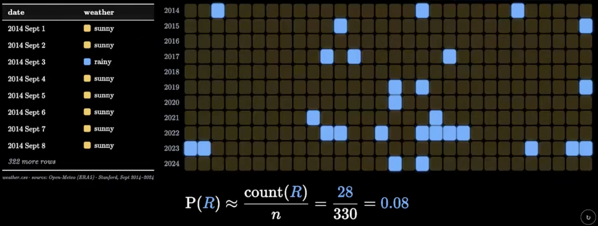</td>
            <td>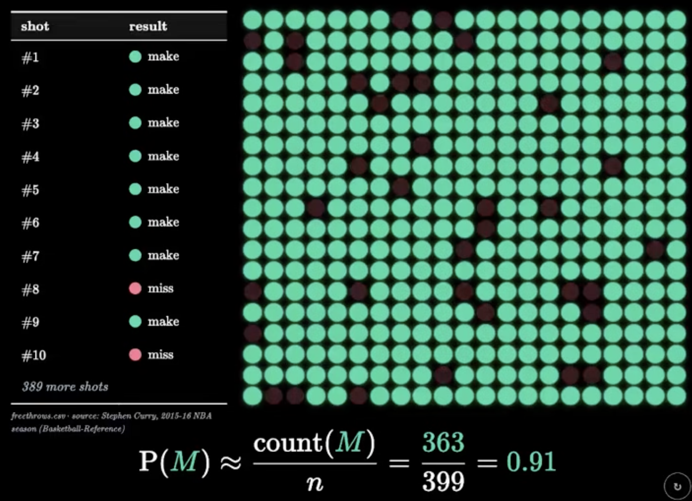</td>
        </tr>
        <tr align="center">
            <td> P(R) = rain in sept @ stanford </td>
            <td> P(M) = curry hits freethrow </td>
        </tr>
    </table>
**defn.** → P = frequency
- P(E) ~ count(E) / n
- n↑ → estimate accuracy↑
        <table>
            <tr>
                <td>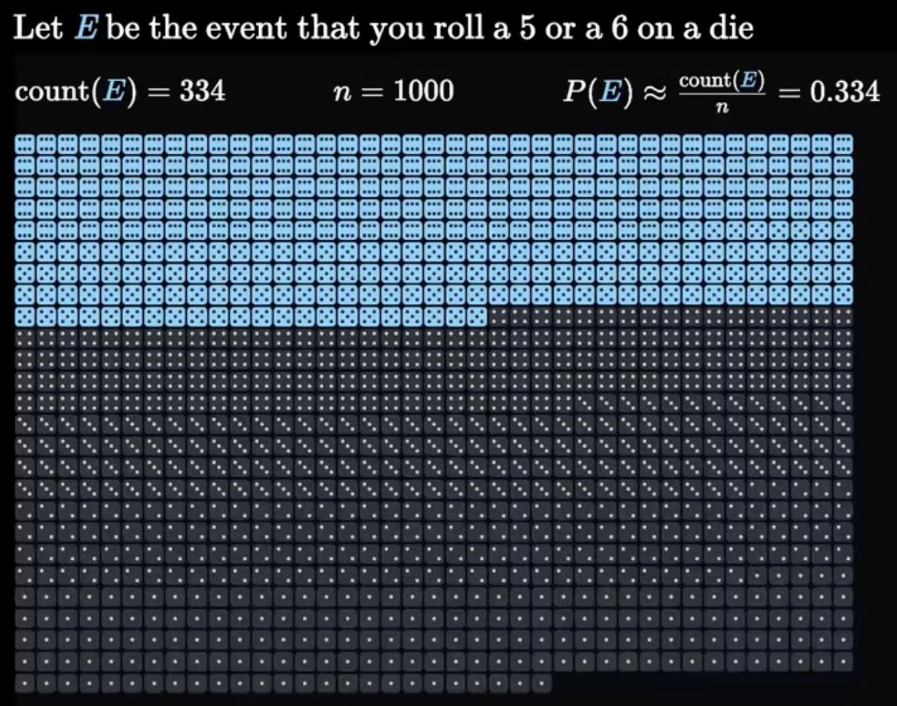</td>
                <td>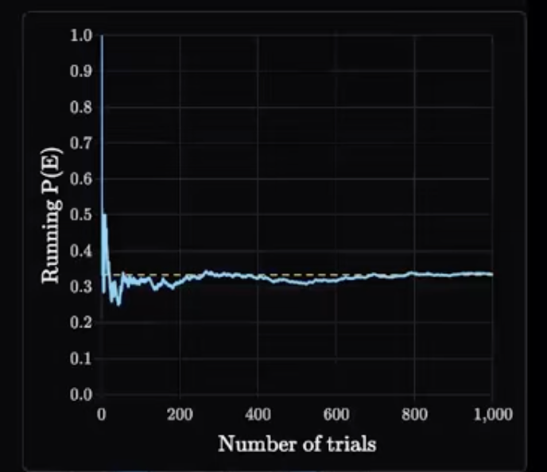</td>
            </tr>
        </table>
- die: 6 outcomes → P(5 or 6) = 2/6 = 1/3 ≈ 0.334
- ⚠️ counterexample: lottery win|lose ≠ P=1/2 (outcomes not equally likely!)
- **equally likely** outcomes → coin (H|T), die (1 - 6)
- how many trials is "enough"?
    <table>
        <tr>
            <td>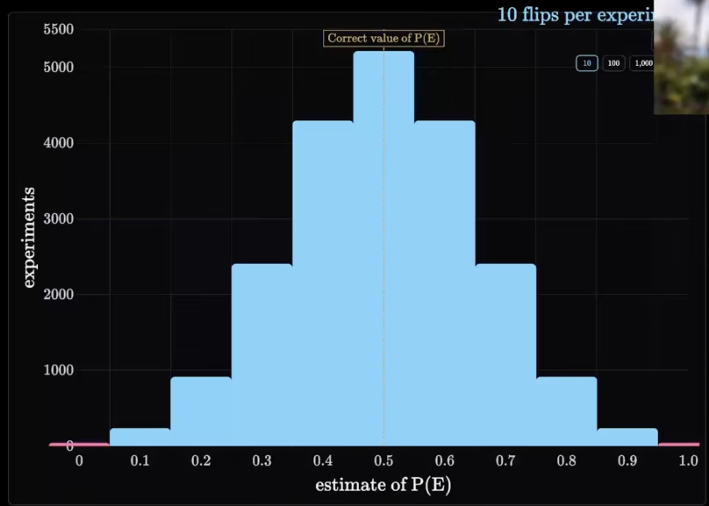</td>
            <td>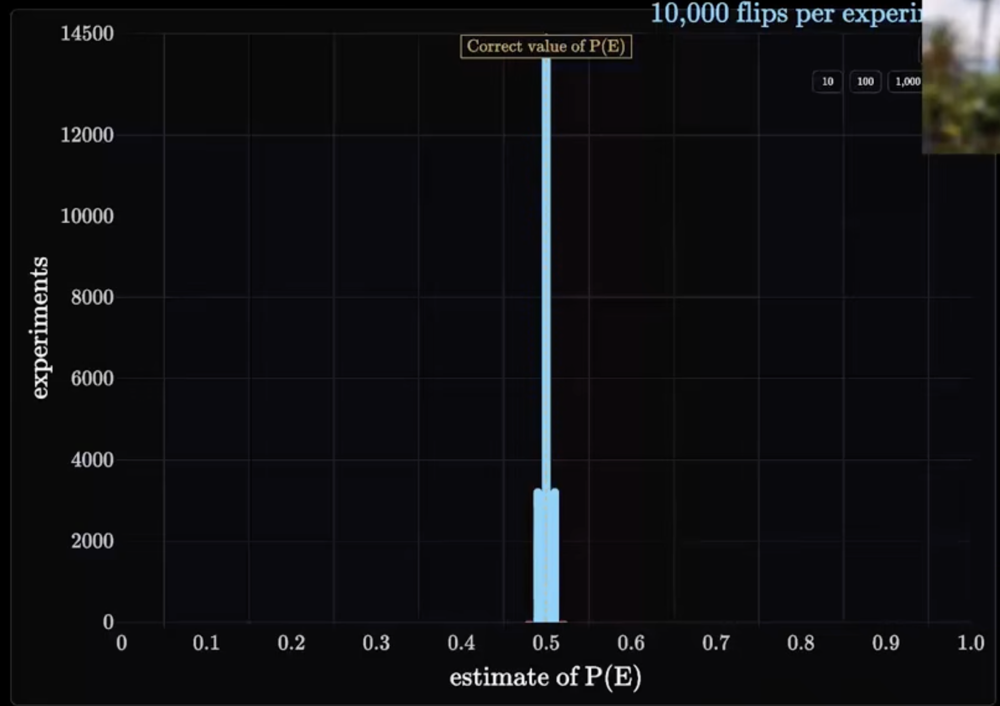</td>
        </tr>
        <tr align="center">
            <td>10 flips → range 0.1 - 0.9</td>
            <td>10k flips → range 0.49 - 0.51</td>
        </tr>
    </table>
- **95% range** = CI containing true P 95% of time → from **CLT**
    <table>
        <tr>
            <td>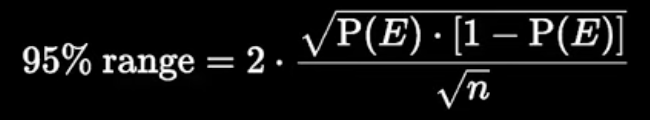</td>
            <td>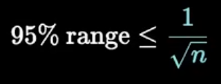</td>
            <td>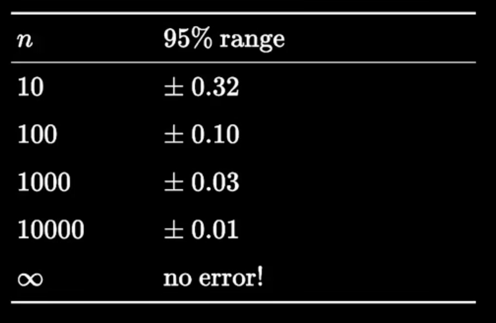</td>
        </tr>
    </table>
- **A/B testing** → compares two variants' P estimates
    <table>
        <tr>
            <td>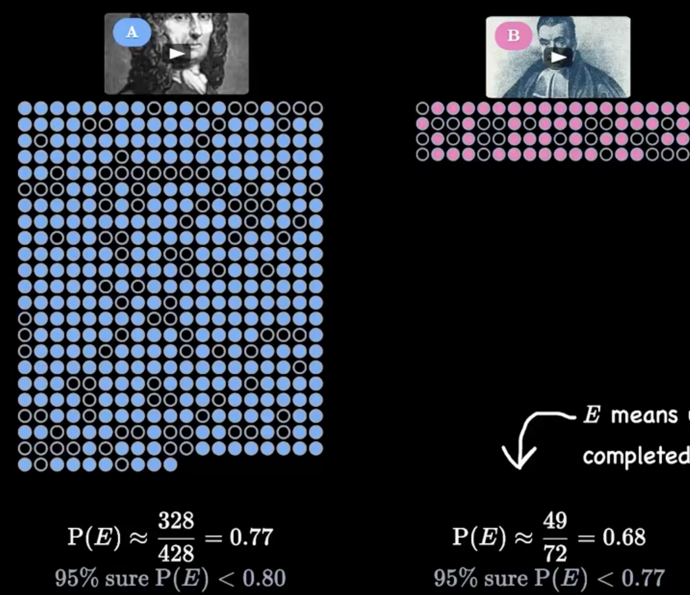</td>
        </tr>
    </table>

---

## [Pre-Class 2](https://www.youtube.com/watch?v=H85YOG-cNeQ)

**Learning Goals**
1. conditional probability
2. estimate conditional P from data
3. LLM = conditional probability engine

**Conditional Probability**
- P(watch Up | watched Moana)? → recommendation-style example
<table>
        <tr>
            <td>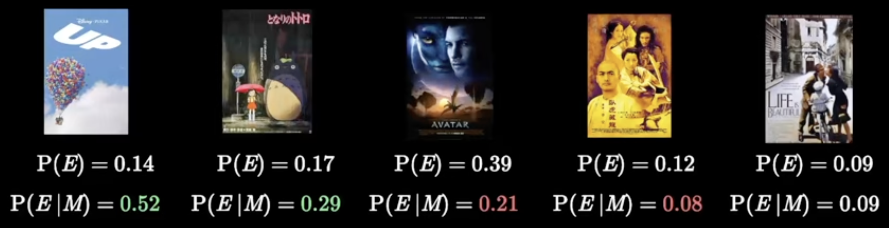</td>
            <td>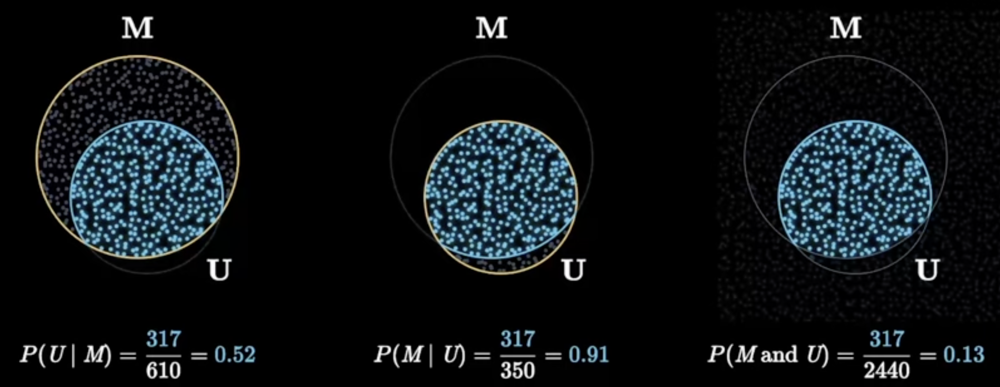</td>
        </tr>
</table>

- S = sunny today, R = rained yesterday → P(S|R)?
<table>
        <tr>
            <td>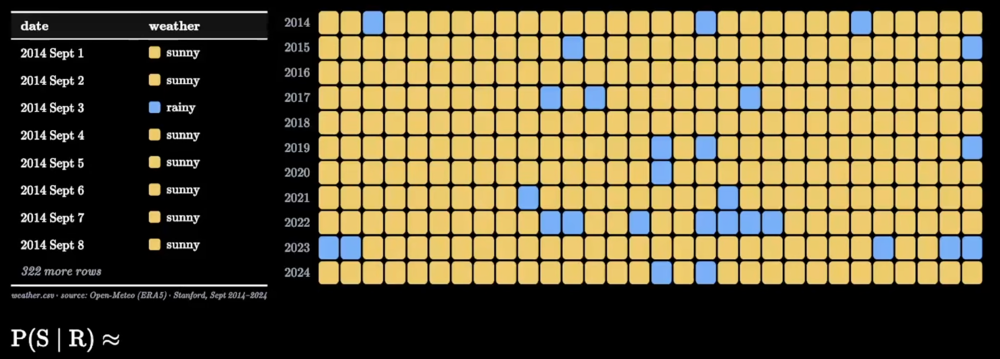</td>
            <td>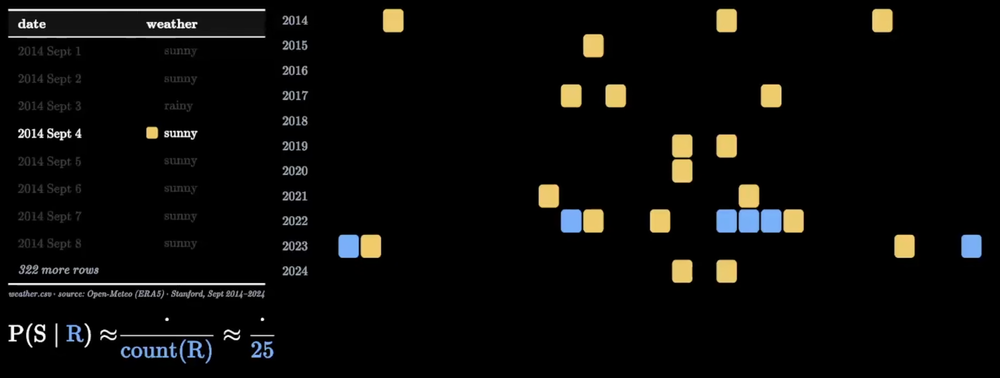</td>
            <td>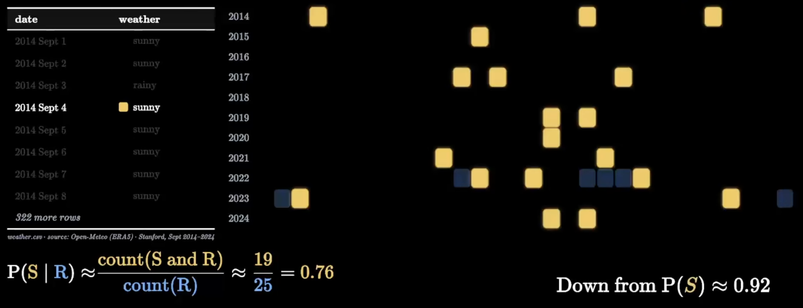</td>
        </tr>
        <tr align="center">
            <td>complete picture</td>
            <td>rainy yesterday</td>
            <td>sunny today</td>
        </tr>
</table>

**defn.** → P(E|F) = P(given F already happened, P of E) = P(E and F) / P(F) → "conditioning upon F"

